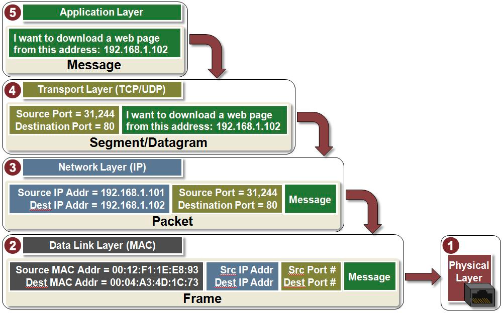

### Package layers (request up-down, response down-up)
***
+ Application `http ftp ssh smtp` developers working with: Header+Body
+ Transport `TCP/UDP` adds Header: source/dest ports, sequence number
+ Network (Internet) `IP` adds Header: source/dest IP-address
+ Data Link `wi-fi, ethernet` adds Header: MAC-address
+ Physical `cables between computers and router` without Header

### UDP protocol
***
+ Light weight (8 bytes only)
+ Connectionless (without ACKs)
+ Consistency (send data no matter what, ignores packet/network troubles)
+ Fast (video games, streaming)

### TCP protocol
***
+ Connection-based (3-way handshake)
+ Reliable (delivery ACK, retransmission, in-order packets)
+ Congestion control

### HTTP protocol
***
+ Header (metadata about body) + Body
+ Based on transport TCP/IP
